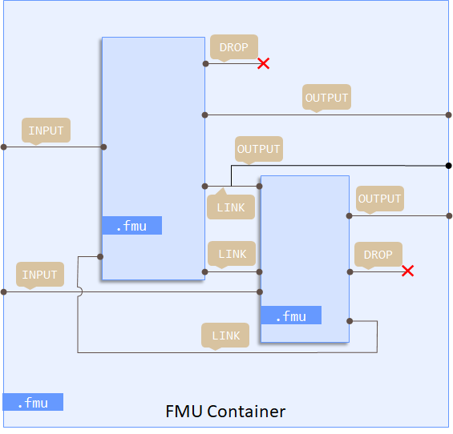

# FMU Containers ?

A FMU Container is classical FMU which embeds other's FMU's.

FMU Manipulation Toolbox ships `fmucontainer` command which makes easy to embed FMU's into FMU.

# FMU Container Description

A FMU Container is described by multiple parameters:

- time step: a FMU Container acts as a fixed step time "solver".
- optional feature
  - multi-threading: 
  - profiling
- routing table
  - Input ports
  - Output ports
  - Connexions between embedded FMU's
  - Explicitly ignored ports (only port with causality = "output" can be ignored)
- Automatic routing table
  - expose automatically ports of embedded FMU's with causality = "input"
  - expose automatically ports of embedded FMU's with causality = "output"
  - link automatically ports of embedded FMU's which are left previously unconnected and have the same names and types

Some of these parameters can be defined by Command Line Interface or by input files.

Several formats are supported for input files:
- a `CSV` format: define only the routing table. Other options are defined witch CLI.
- a `JSON` file: all parameters can be defined in the file. CLI can defined default values if option is not present in
  `JSON` file.
- a `SSP` file. See [ssp-standard.org](https://ssp-standard.org). define only the routing table. Other options are
  defined witch CLI.

## CSV Input file

## Json Input file

## SSP Input file

