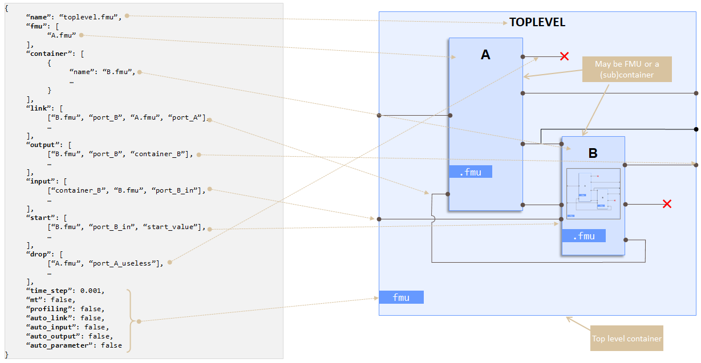

# FMU Containers ?

A FMU Container is classical FMU which embeds other's FMU's:


FMU Manipulation Toolbox ships `fmucontainer` command which makes easy to embed FMU's into FMU.


# How to create an FMU Container ?

The `fmucontainer` command creates container from a description file. This file contains multiple parameters:

- *time_step*: a FMU Container acts as a fixed step time "solver" for its embedded FMU's.
- optional features
  - *multi-threading*: each embedded FMU will use its own thread to parallelize `doStep()` operation.  
  - *profiling*: performance indicators can be calculated by the container to help to identify the bottlenecks among 
    the embedded FMU's.
- routing table
  - Input ports: the list of container's inputs. Each input is linked to one input of one of the embedded FMU's.
  - Output ports: the list of container's outputs. Each output is linked to one output of one of the embedded FMU's.
  - Connexions between embedded FMU's
  - Explicitly ignored ports (only port with `causality = "output"` can be ignored)
- Automatic routing table
  - *auto_input* exposes automatically the (unconnected) ports of embedded FMU's with `causality = "input"`
  - *auto_output* expose automatically the (unconnected) ports of embedded FMU's with `causality = "output"`
  - *auto_local* expose automatically the ports of embedded FMU's with `causality = "local"`
  - *auto_parameter* expose automatically the ports of embedded FMU's with `causality = "parameter"`
  - *auto_link* links automatically ports of embedded FMU's which are left previously unconnected and have the same
    names and types

Some of these parameters can be defined by Command Line Interface or by the input files.

Several formats are supported as description files:
- a `CSV` format: define only the routing table. Other options are defined as command line options.
- a `JSON` file: all parameters can be defined in the file. Command line can define default values if the parameter 
  is not present in `JSON` file.
- a `SSP` file. See [ssp-standard.org](https://ssp-standard.org). define only the routing table. Other options are defined with command line.


## CSV Input file

Example: 
  * Two FMU's to be assembled: `bb_position.fmu` and `bb_velocity.fmu`
  * Container should expose `position1` from `bb_position.fmu` as `position`
  * Container has no input
  * there's two links between embedded FMU's


the `container.csv` file content:

```csv
rule;from_fmu;from_port;to_fmu;to_port
FMU;bb_position.fmu;;;
FMU;bb_velocity.fmu;;;
OUTPUT;bb_position.fmu;position1;;position
LINK;bb_position.fmu;is_ground;bb_velocity.fmu;reset
LINK;bb_velocity.fmu;velocity;bb_position.fmu;velocity
OUTPUT;bb_velocity.fmu;velocity;;
```

Asserting the FMU's and the CSV files are located in current working directory,
the following command will build the container:

```
fmucontainer -container container.csv
```

Then `container.fmu` should be available.


## Json Input file



```
fmucontainer -container container.json
```

## SSP Input file
 
This feature is still alpha.

The following command 
```
fmucontainer -container my_file.ssp
```

will 
1. extact FMU's from the SSP file
2. build a container accordingly to the SSP


